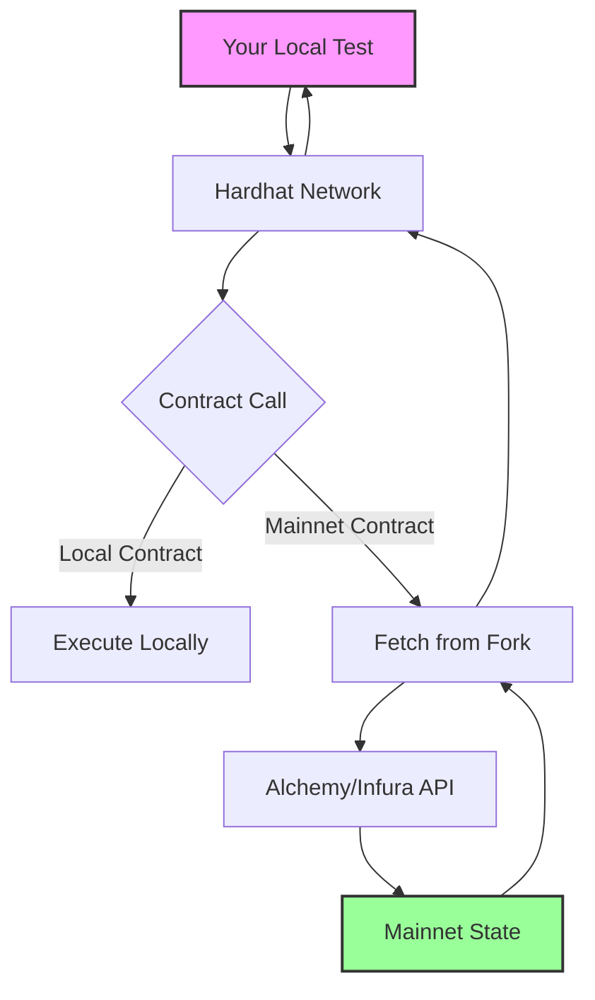

# Mainnet Forking Guide for ValidatorSale Testing

## What is Mainnet Forking?

Mainnet forking creates a local copy of the Ethereum blockchain that includes all deployed contracts, balances, and state from the real network. This enables testing against real protocols without spending real money.

## Why Do We Need It?

The ValidatorSale contract's `quote` function interacts with:
- **Uniswap V3 Quoter**: `0x61fFE014bA17989E743c5F6cB21bF9697530B21e`
- **USDC Token**: `0xA0b86991c6218b36c1d19D4a2e9Eb0cE3606eB48`

These contracts only exist on mainnet. Without forking, calls to these addresses fail because there's nothing deployed there on your local Hardhat network.

## How to Set Up Mainnet Forking

### 1. Get an RPC Provider Key

Sign up for a free account at:
- [Alchemy](https://www.alchemy.com/) 
- [Infura](https://infura.io/)
- [QuickNode](https://www.quicknode.com/)

### 2. Configure Hardhat

Update your `hardhat.config.ts`:

```typescript
import { HardhatUserConfig } from "hardhat/config";
import "@nomicfoundation/hardhat-toolbox";
import * as dotenv from "dotenv";

dotenv.config();

const config: HardhatUserConfig = {
  solidity: "0.8.24",
  networks: {
    hardhat: {
      forking: {
        url: process.env.FORK_URL || "",
        blockNumber: 18500000, // Optional: Pin to specific block
        enabled: true
      }
    }
  }
};

export default config;
```

### 3. Set Environment Variable

Create a `.env` file:
```bash
FORK_URL=https://eth-mainnet.alchemyapi.io/v2/YOUR_API_KEY
```

### 4. Run Tests with Forking

```bash
# This will automatically use the forked network
npx hardhat test test/ValidatorSale.quote.test.ts

# Or explicitly:
npx hardhat test test/ValidatorSale.quote.test.ts --network hardhat
```

## What Happens During Forking?



1. **Initial Setup**: Hardhat connects to mainnet via your RPC provider
2. **State Caching**: First access to a contract fetches its state from mainnet
3. **Local Execution**: Subsequent calls use cached state
4. **Modifications**: Any changes only affect your local fork

## Testing the Quote Function

### Without Forking (Current Behavior)
```
ValidatorSale.quote() → Uniswap Quoter (doesn't exist) → ❌ Revert
```

### With Forking
```
ValidatorSale.quote() → Uniswap Quoter (from mainnet) → ✅ Returns actual quote
```

## Example Test Results

With mainnet forking, the quote tests will return real values:

```javascript
// Example output with forking enabled:
const wethNeeded = await validatorSale.quote(WETH_ADDRESS, 3000);
console.log(`Need ${ethers.formatEther(wethNeeded)} ETH`);
// Output: "Need 24.532 ETH" (actual market price)

const wbtcNeeded = await validatorSale.quote(WBTC_ADDRESS, 500);
console.log(`Need ${wbtcNeeded / 1e8} BTC`);
// Output: "Need 1.23 BTC" (actual market price)
```

## Benefits of Mainnet Forking

1. **Real Protocol Testing**: Test against actual Uniswap pools with real liquidity
2. **Accurate Quotes**: Get real market prices, not mocked values
3. **Integration Testing**: Verify your contract works with live protocols
4. **No Cost**: Everything runs locally, no gas fees
5. **Time Control**: Can manipulate block timestamps for testing

## Common Issues and Solutions

### Issue: Slow Tests
**Solution**: Pin to a specific block number to avoid re-fetching state
```javascript
forking: {
  url: process.env.FORK_URL,
  blockNumber: 18500000 // Pin to specific block
}
```

### Issue: Rate Limits
**Solution**: Use a paid tier or cache fork data locally
```bash
# Cache fork data
npx hardhat node --fork $FORK_URL
```

### Issue: Outdated Prices
**Solution**: Don't pin block number for recent price data
```javascript
forking: {
  url: process.env.FORK_URL
  // No blockNumber = use latest block
}
```

## Running Different Test Suites

```bash
# Basic validation tests (no forking needed)
npm run hh:test -- test/ValidatorSale.quote.simple.test.ts

# Full integration tests (requires forking)
npm run hh:test -- test/ValidatorSale.quote.test.ts

# All tests with forking
FORK_ENABLED=true npm run hh:test
```

## Conclusion

Mainnet forking is essential for testing DeFi integrations. It provides a realistic testing environment while maintaining the speed and control of local development. For the ValidatorSale quote function, it's the only way to get actual price quotes from Uniswap without deploying to mainnet.