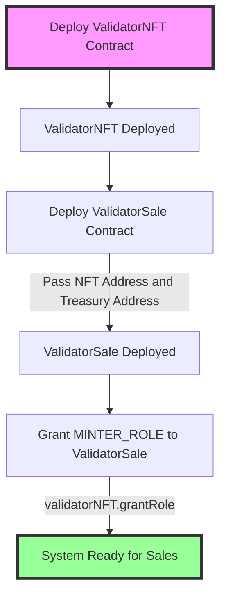
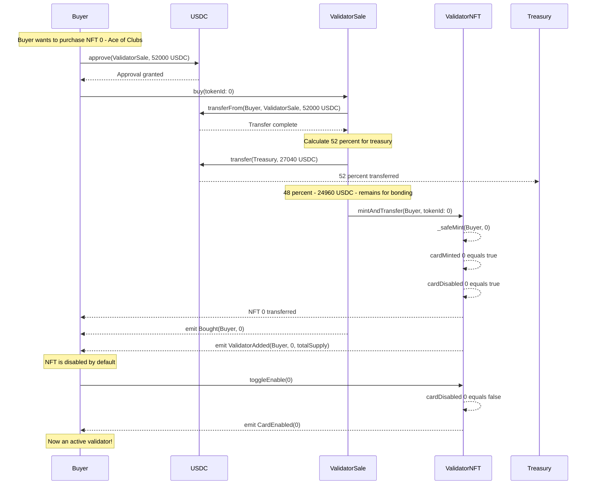
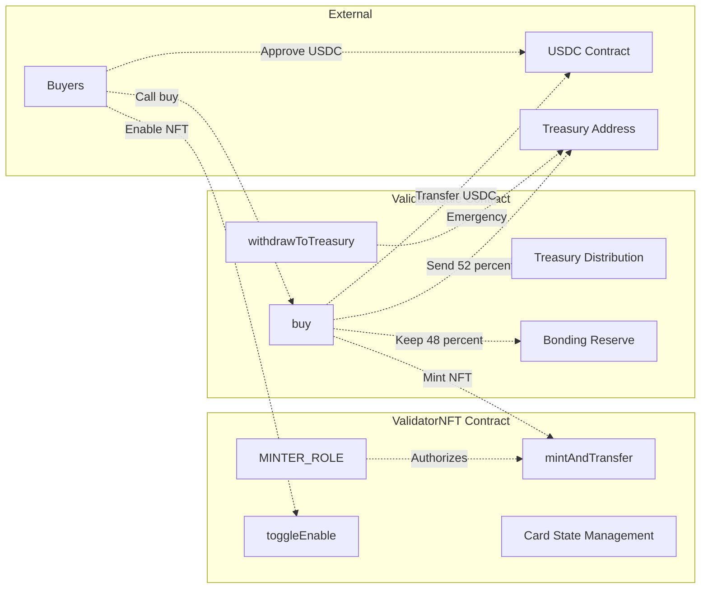
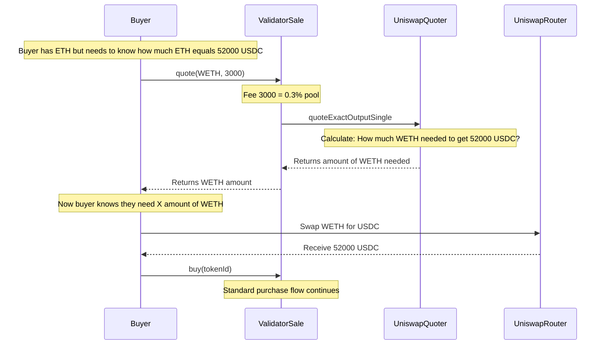
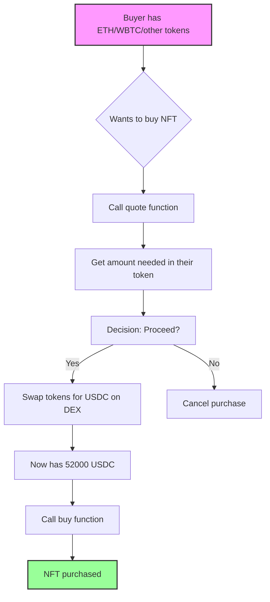

# ValidatorNFT and ValidatorSale Flow Diagrams

## Deployment Flow



## Sale Process Flow



## Contract Interactions Overview



### Flow Description:
1. **Buyers → USDC Contract**: Approve USDC spending
2. **Buyers → buy()**: Call purchase function
3. **buy() → USDC Contract**: Transfer payment
4. **buy() → Treasury Address**: Send 52%
5. **buy() → Bonding Reserve**: Keep 48%
6. **buy() → mintAndTransfer()**: Mint NFT
7. **MINTER_ROLE → mintAndTransfer()**: Authorizes minting
8. **Buyers → toggleEnable()**: Enable validator NFT
9. **withdrawToTreasury() → Treasury Address**: Emergency withdrawal

## Key Features

### ValidatorNFT
- **52 unique NFTs** representing a deck of cards
- **Access Control**: Only addresses with MINTER_ROLE can mint
- **Default Disabled**: NFTs are disabled when minted
- **Owner Control**: Only token owners can enable/disable their NFTs

### ValidatorSale  
- **Fixed Price**: 52,000 USDC per NFT
- **Treasury Split**: 52% immediately to treasury
- **Bonding Reserve**: 48% held for validator bonding/slashing
- **Mint on Purchase**: No pre-minting required
- **Failsafe**: Owner can withdraw bonding funds if needed

## Deployment Steps

1. Deploy ValidatorNFT with name and symbol
2. Deploy ValidatorSale with ValidatorNFT address and treasury address
3. Grant MINTER_ROLE on ValidatorNFT to ValidatorSale contract
4. System is ready for purchases

## Purchase Steps

### Direct USDC Purchase
1. Buyer approves USDC spending to ValidatorSale
2. Buyer calls `buy(tokenId)` with desired card ID (0-51)
3. Contract transfers 52,000 USDC from buyer
4. Contract sends 27,040 USDC (52%) to treasury
5. Contract keeps 24,960 USDC (48%) for bonding
6. Contract mints and transfers NFT to buyer
7. Buyer calls `toggleEnable(tokenId)` to activate validator status

### Quote System for Other Tokens

The `quote` function allows buyers to check prices in other tokens (ETH, WBTC, etc.) before purchasing:



#### Why the Quote Function?

1. **Price Discovery**: Buyers can check how much of any token (ETH, WBTC, DAI) they need to purchase an NFT
2. **Multi-token Support**: While the sale only accepts USDC, buyers can plan their token swaps
3. **Fee Tiers**: Supports different Uniswap pool fee tiers (0.05%, 0.3%, 1%)
4. **Exact Output**: Calculates the exact input needed to get 52,000 USDC

#### Example Usage:
```solidity
// Check how much WETH is needed
uint256 wethNeeded = validatorSale.quote(WETH_ADDRESS, 3000);

// Check how much WBTC is needed  
uint256 wbtcNeeded = validatorSale.quote(WBTC_ADDRESS, 500);

// Buyer then swaps their token for USDC on Uniswap before purchasing
```

### Quote System Flow Overview



## Testing Setup

### Mainnet Forking for Quote Function Testing

The quote function requires interaction with Uniswap contracts on mainnet. To test this functionality locally, you need to set up mainnet forking:

#### 1. Get an RPC Provider
Sign up for a free account at:
- [Alchemy](https://www.alchemy.com/)
- [Infura](https://infura.io/)

#### 2. Configure Environment
Create a `.env` file in the contracts directory:
```bash
FORK_URL=https://eth-mainnet.alchemyapi.io/v2/YOUR_API_KEY
```

#### 3. Update Hardhat Config
Add forking configuration to `hardhat.config.ts`:
```typescript
networks: {
  hardhat: {
    forking: {
      url: process.env.FORK_URL || "",
      blockNumber: 18500000 // Optional: Pin to specific block
    }
  }
}
```

#### 4. Run Tests

Copy and paste these commands to run specific test suites:

```bash
# Run all tests
npm run hh:test

# ValidatorNFT Tests
npm run hh:test -- contracts/test/ValidatorNFT.test.ts

# ValidatorSale Integration Tests  
npm run hh:test -- contracts/test/ValidatorSale.test.ts

# ValidatorNFT and Sale Integration Tests
npm run hh:test -- contracts/test/ValidatorNFTSale.integration.test.ts

# Quote Function Tests (Simple - No Forking Required)
npm run hh:test -- contracts/test/ValidatorSale.quote.simple.test.ts

# Quote Function Tests (Full - Requires Mainnet Forking)
npm run hh:test -- contracts/test/ValidatorSale.quote.test.ts

# Run Multiple Specific Tests
npm run hh:test -- contracts/test/ValidatorNFT.test.ts contracts/test/ValidatorSale.test.ts

# Run Tests with Gas Reporting
REPORT_GAS=true npm run hh:test

# Run Tests with Coverage
npm run hh:coverage
```

#### Test File Descriptions

| Test File | Description | Forking Required |
|-----------|-------------|------------------|
| `ValidatorNFT.test.ts` | Core NFT functionality, minting, toggling | No |
| `ValidatorSale.test.ts` | Purchase flow with mocked USDC | No |
| `ValidatorNFTSale.integration.test.ts` | Integration between NFT and Sale contracts | No |
| `ValidatorSale.quote.simple.test.ts` | Basic quote validation tests | No |
| `ValidatorSale.quote.test.ts` | Full quote tests with real Uniswap | **Yes** |

### Why Mainnet Forking?
- The quote function calls Uniswap V3 Quoter at `0x61fFE014bA17989E743c5F6cB21bF9697530B21e`
- This contract only exists on mainnet
- Forking creates a local copy with all mainnet contracts and state
- Enables realistic testing without spending real money