# B52 Poker Economics

> **For**: Poker Players, Club Operators, Game Hosts
> **Network**: Block52 Decentralized Poker

---

## How It Works

Block52 is a decentralized poker network. Instead of one company running the games and taking rake, the network is run by 52 independent validators who share the fees. Anyone can earn a piece of the action by staking B52 tokens.

---

## The Rake Structure

### Traditional Online Poker vs Block52

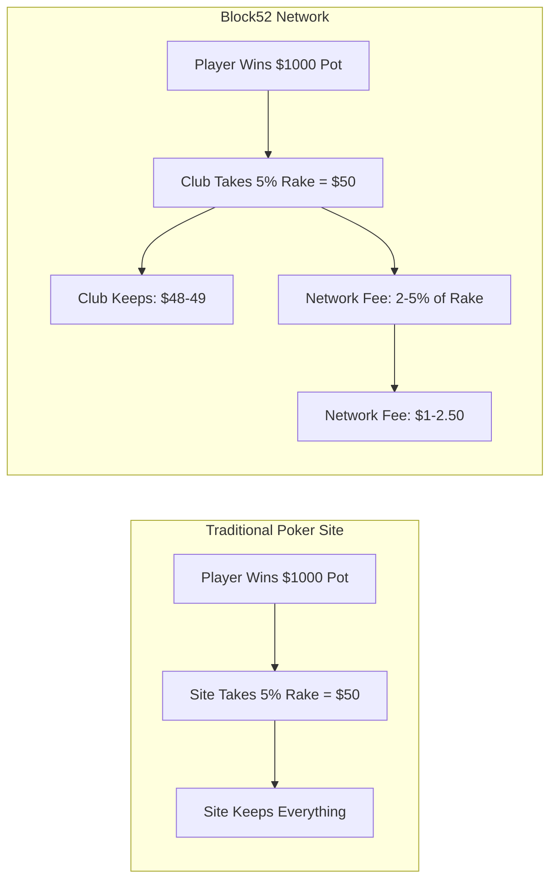

### Where Does the Network Fee Go?

The small network fee (percentage of rake) pays for running a decentralized, cheat-proof poker network.

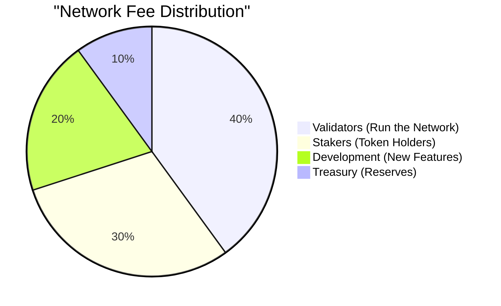

---

## For Players: Earn While You Play

### Stake B52, Get Rakeback

When you stake B52 tokens, you earn a share of ALL network fees - not just from your games, but from every game on the network.

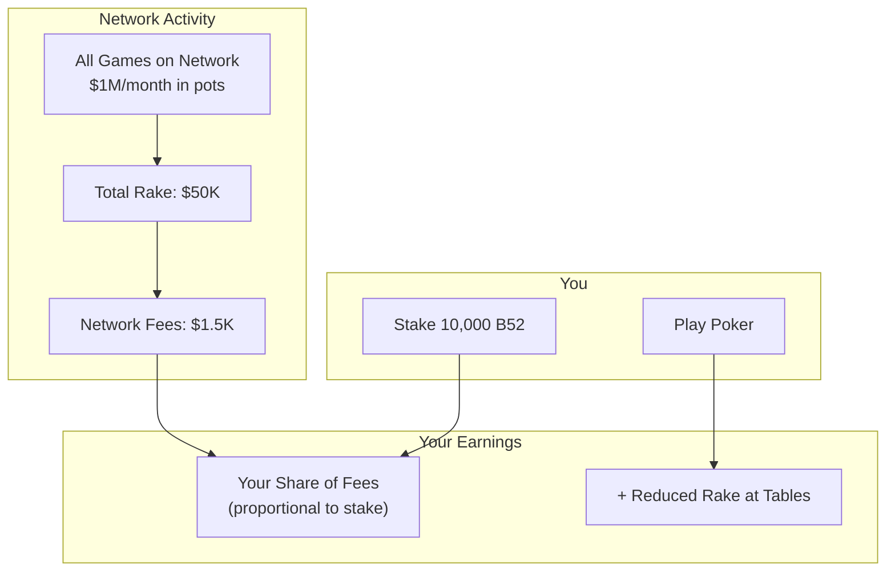

### Player Staking Tiers

| Stake Amount | Rake Reduction | Network Fee Share | Other Benefits |
|--------------|----------------|-------------------|----------------|
| 1,000+ B52 | 25% off | Yes | Basic rewards |
| 25,000+ B52 | 35% off | Yes | Priority support |
| 50,000+ B52 | 50% off | Yes | Premium features |

**The more you stake, the less rake you pay.**

---

## For Club Operators: Run Your Own Club

### Club Economics

As a club operator on Block52, you set your own rake and keep most of it. The network only takes a small cut for providing the infrastructure.

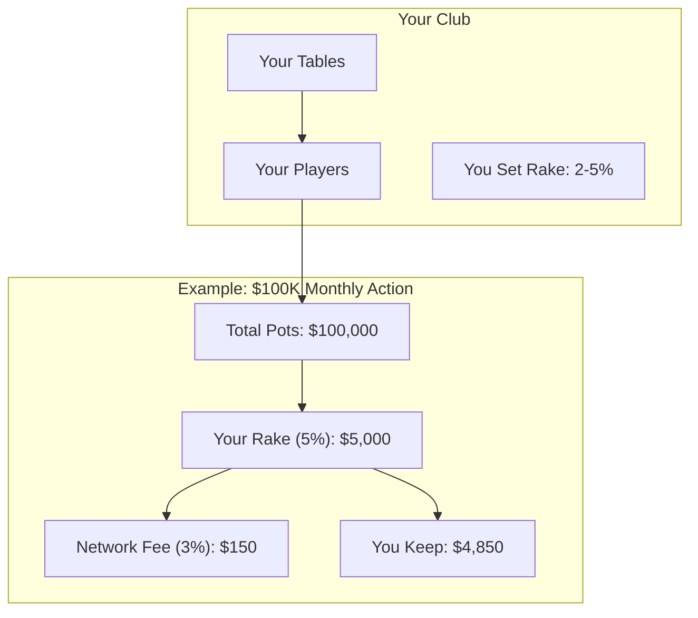

### What You Get

- **Your brand, your players, your rake**
- Provably fair shuffling (players can verify)
- No chargebacks (crypto settlements)
- Global player pool (no geo restrictions)
- 24/7 uptime (decentralized network)

### Club Operator Staking

Stake 25,000+ B52 to unlock club operator features:

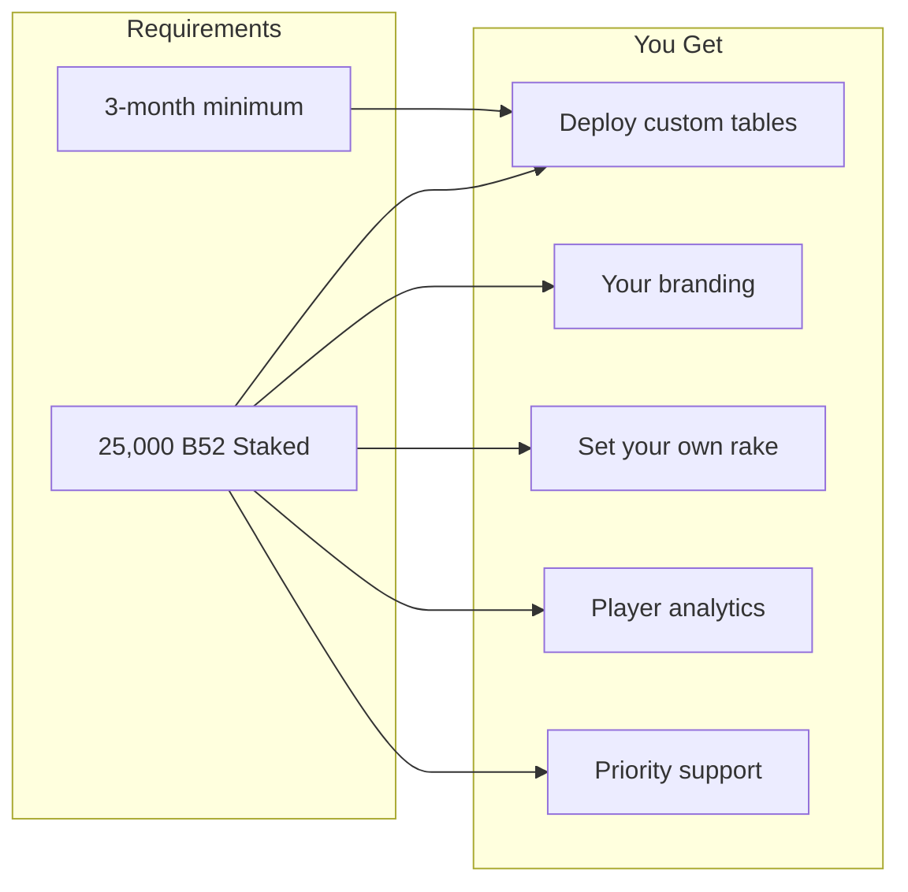

---

## For Investors: Own the Network

### The B52 Value Proposition

Owning B52 tokens = Owning a piece of every poker game on the network.

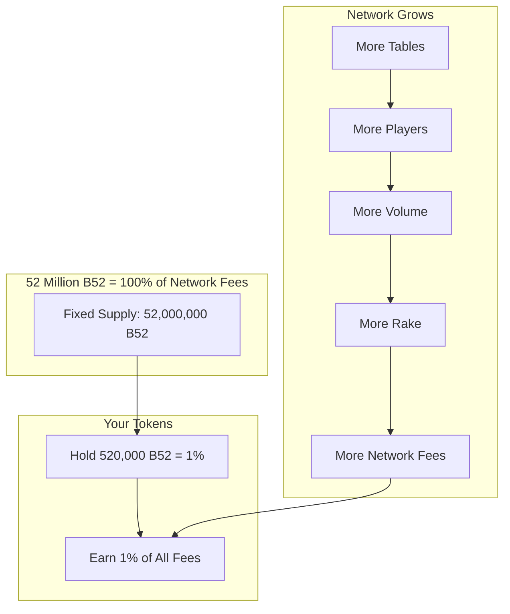

### Passive Income Example

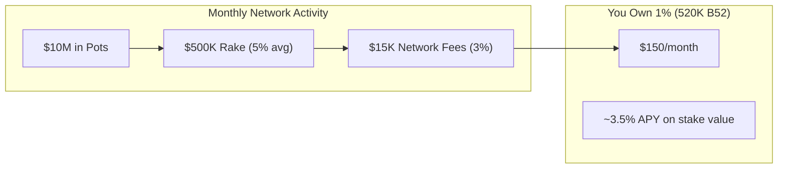

*Note: Returns scale with network activity. More games = more fees = higher returns.*

---

## The Rake Flow: Complete Picture

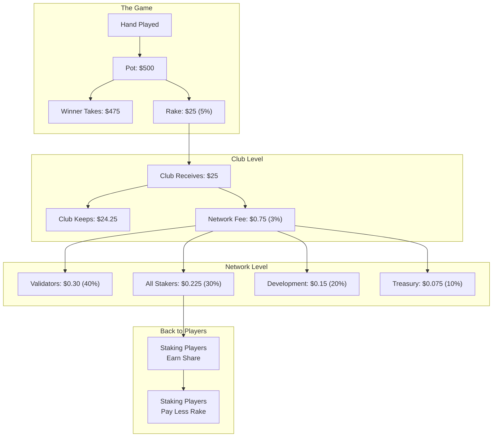

---

## Staking: Validator vs Delegation

### Option 1: Run a Validator Node (High Commitment)

For serious operators who want maximum rewards.

| Requirement | Details |
|-------------|---------|
| Stake | 100,000+ B52 |
| Hardware | Dedicated server, 99.9% uptime |
| Technical | Run node software |
| Rewards | Highest tier + block rewards |

### Option 2: Delegate to a Validator (Easy)

For players and investors who just want passive income.

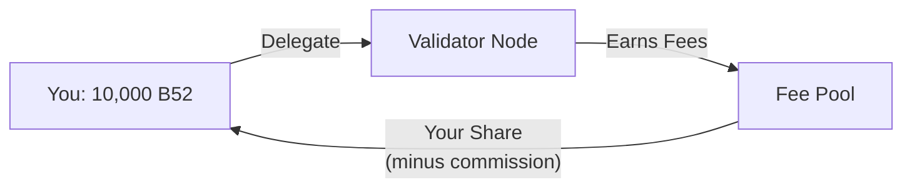

| Requirement | Details |
|-------------|---------|
| Stake | 1,000+ B52 minimum |
| Hardware | None |
| Technical | Just click delegate |
| Rewards | Proportional share minus validator commission |

---

## Why Decentralized Poker?

### The Problem with Traditional Sites

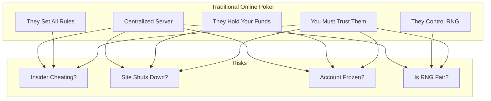

### Block52 Solution

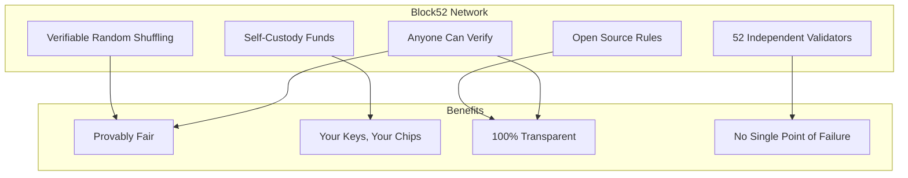

---

## Quick Reference

| Term | Meaning |
|------|---------|
| **B52** | Network token for staking & governance |
| **b52USDC** | Playing chips (1:1 with USDC) |
| **Rake** | % taken from pot by club |
| **Network Fee** | Small % of rake that goes to network |
| **Staking** | Locking B52 to earn network fees |
| **Delegation** | Staking with a validator (no hardware needed) |
| **Validator** | Node operator who runs the network |

---

## Get Started

1. **Get B52 tokens** - [Exchange TBD]
2. **Stake or Delegate** - Earn passive income from all games
3. **Play poker** - Use b52USDC at any table
4. **Run a club** - Stake 25K+ B52 to deploy your own tables

---

*Document Version: Draft 1.0*
*Last Updated: December 2024*
*For: Poker Community*
