# B52 Token Economics

> **Total Supply**: 52,000,000 B52 (Fixed Forever)
> **Network**: Block52 Decentralized Poker

---

## What is B52?

B52 is the native token of the Block52 network. You earn a share of every card game by **contributing** to the network:

```mermaid
flowchart TB
    subgraph "Two Ways to Contribute & Earn"
        direction LR
        Path1["🖥 PROVIDE SECURITY<br/>Run a Validator or Relay Node"]
        Path2["🔒 PROVIDE STABILITY<br/>Delegate Your Tokens"]
    end

    subgraph "What You Provide"
        Sec["Infrastructure<br/>Decentralization<br/>Game Verification"]
        Stab["Economic Security<br/>Attack Resistance<br/>Stake Distribution"]
    end

    subgraph "What You Earn"
        Earn["Share of Fees<br/>from ALL Games"]
    end

    Path1 --> Sec --> Earn
    Path2 --> Stab --> Earn
```



| Contribution | What You Do | What It Provides |
|--------------|-------------|------------------|
| **Security** | Run a validator or relay node | Infrastructure, decentralization, game verification |
| **Stability** | Delegate your B52 tokens | Economic security, attack resistance, stake distribution |

**Both are essential.** The network needs infrastructure to run AND economic security to be trustworthy.

---

## Two Tokens, Two Purposes

| Token | Purpose | Supply |
|-------|---------|--------|
| **B52** | Staking, Governance, Network Security | 52,000,000 (fixed) |
| **b52USDC** | Playing chips for poker games | Variable (1:1 with USDC) |


---

## How You Earn

Every poker game on Block52 generates a small security fee. This fee is distributed to everyone who stakes B52.


---

## Fee Distribution


| Recipient | Default | Range | Who They Are |
|-----------|---------|-------|--------------|
| **Validators** | 40% | 30-50% | Run the network infrastructure (52 max) |
| **Delegators** | 30% | 20-40% | Anyone who stakes B52 tokens |
| **Development** | 20% | Fixed | Funds new features and improvements |
| **Treasury** | 10% | Fixed | Reserve for emergencies and grants |

---

## The Incentive Pendulum

The split between validators and delegators isn't fixed - it swings like a pendulum based on what the network needs.

```mermaid
flowchart TB
    subgraph "The Pendulum"
        direction LR
        Left["⬅ NEED MORE<br/>INFRASTRUCTURE"]
        Center["⚖ BALANCED"]
        Right["NEED MORE<br/>STAKERS ➡"]
    end

    subgraph "Pendulum Swings Left"
        L1["Not enough validators?"]
        L2["Validators get 50%"]
        L3["Delegators get 20%"]
        L4["Attracts more node operators"]
    end

    subgraph "Pendulum Centered"
        C1["Network is healthy"]
        C2["Validators get 40%"]
        C3["Delegators get 30%"]
        C4["Default equilibrium"]
    end

    subgraph "Pendulum Swings Right"
        R1["Not enough stake?"]
        R2["Validators get 30%"]
        R3["Delegators get 40%"]
        R4["Attracts more stakers"]
    end

    Left --> L1 --> L2 --> L3 --> L4
    Center --> C1 --> C2 --> C3 --> C4
    Right --> R1 --> R2 --> R3 --> R4
```



### Why the Pendulum?

The network needs **two things** to be secure:

| Need | Who Provides It | Problem If Missing |
|------|-----------------|-------------------|
| **Infrastructure** | Validators & Relay Nodes | Games can't run, network is slow |
| **Economic Security** | Stakers & Delegators | Network is cheap to attack |


### Pendulum Range

| Network State | Validators | Delegators | Dev | Treasury |
|---------------|------------|------------|-----|----------|
| **Need Infrastructure** | 50% | 20% | 20% | 10% |
| **Balanced (Default)** | 40% | 30% | 20% | 10% |
| **Need Stakers** | 30% | 40% | 20% | 10% |

**Note:** Development (20%) and Treasury (10%) stay fixed. Only the 70% going to validators + delegators shifts based on network needs.

### What Triggers the Pendulum?

The pendulum adjusts automatically based on network health metrics:

```mermaid
flowchart TB
    subgraph "Network Health Check"
        Check["Every Epoch (e.g., daily)"]
        Metrics["Measure Key Metrics"]
    end

    subgraph "Trigger Events"
        T1["🔴 Infrastructure Alert"]
        T2["🟡 Warning Zone"]
        T3["🟢 Healthy"]
        T4["🔴 Security Alert"]
    end

    subgraph "Pendulum Response"
        R1["Swing to Validators<br/>50% / 20%"]
        R2["Slight Adjustment<br/>45% / 25%"]
        R3["Stay Balanced<br/>40% / 30%"]
        R4["Swing to Delegators<br/>30% / 40%"]
    end

    Check --> Metrics
    Metrics --> T1 & T2 & T3 & T4
    T1 --> R1
    T2 --> R2
    T3 --> R3
    T4 --> R4
```



### Trigger Thresholds

| Metric | Threshold | Pendulum Action | New Ratio |
|--------|-----------|-----------------|-----------|
| **Active Validators** | < 40 of 52 | Swing to Validators | 50% / 20% |
| **Active Validators** | 40-51 of 52 | Slight swing to Validators | 45% / 25% |
| **Active Validators** | 52 of 52 | Balanced | 40% / 30% |
| **Relay Nodes** | < 50 globally | Swing to Validators | 50% / 20% |
| **Total Staked** | < 25% of supply | Swing to Delegators | 30% / 40% |
| **Total Staked** | 25-40% of supply | Slight swing to Delegators | 35% / 35% |
| **Total Staked** | > 50% of supply | Balanced | 40% / 30% |
| **Stake Concentration** | Top 3 validators > 50% | Swing to Delegators | 30% / 40% |

### Example: Pendulum in Action


**The pendulum is self-correcting:** When something is lacking, higher rewards attract what's needed. When balanced, rewards stabilize.

---

## Two Ways to Earn

### Option 1: Delegate (Easy)

Just stake your B52 with a validator. No hardware, no technical skills.


| Requirement | Details |
|-------------|---------|
| Minimum | 1,000 B52 |
| Hardware | None |
| Technical | Just click delegate |
| Earnings | Share of 30% delegator pool |

### Option 2: Run a Validator (Advanced)

Run network infrastructure for maximum rewards.


| Requirement | Details |
|-------------|---------|
| Minimum | 100,000 B52 |
| Hardware | Dedicated server, 99.9% uptime |
| Technical | Run node software 24/7 |
| Earnings | Share of 40% validator pool + commission |

---

## Staking Tiers

| Tier | Stake Required | Benefits |
|------|----------------|----------|
| **Player** | 1,000+ B52 | 25% reduced fees, revenue share |
| **Developer** | 25,000+ B52 | Deploy custom games, API access |
| **Premium** | 50,000+ B52 | 50% reduced fees, priority support |
| **Validator** | 100,000+ B52 | Run a node, highest rewards |

---

## Concrete Example: $10 Pot

When someone wins a $10 pot, here's exactly where the money goes:


---

## Monthly Earnings Example

**Scenario:** Network processes $10M in pots per month

| | Amount |
|---|---|
| Total Pots | $10,000,000 |
| Security Fees (0.2%) | $20,000 |
| To Validators (40%) | $8,000 |
| To Delegators (30%) | $6,000 |

### If You Delegate 10,000 B52

Assuming 20M B52 total staked network-wide:

```
Your share = 10,000 / 20,000,000 = 0.05%
Monthly earnings = $6,000 × 0.05% = $3/month
```

### If You Run a Validator

Assuming you're 1 of 52 validators:

```
Your share = 1/52 of validator pool
Monthly earnings = $8,000 / 52 = ~$154/month
Plus commission from your delegators
```

---

## Earnings Scale With Volume

| Monthly Volume | Security Fees | Validators Get | Delegators Get |
|----------------|---------------|----------------|----------------|
| $1M | $2,000 | $800 | $600 |
| $10M | $20,000 | $8,000 | $6,000 |
| $100M | $200,000 | $80,000 | $60,000 |
| $1B | $2,000,000 | $800,000 | $600,000 |

---

## The 52 Validators

Block52 has exactly 52 validators - one for each card in the deck.


**How to become active:** Have more total stake (your bond + delegations) than the lowest active validator.

---

## Security: Slashing

Validators who misbehave lose their stake. This keeps everyone honest.

| Offense | Penalty |
|---------|---------|
| **Downtime** | 0.1% per hour offline |
| **Failed verification** | 10% of stake |
| **Double-signing** | 100% of stake |

**Delegators share this risk.** If your validator is slashed, you lose proportionally. Choose validators carefully.

---

## Governance

B52 holders vote on network changes:


**What can be governed:**
- Fee percentages
- Slashing amounts
- New game types
- Treasury spending
- Protocol upgrades

---

## Bridge: USDC to b52USDC

Players deposit USDC from Base Chain to get b52USDC for playing.


Withdrawals work in reverse - burn b52USDC, receive USDC on Base Chain.

---

## Why B52 Has Value


| Driver | How It Works |
|--------|--------------|
| **Fixed Supply** | Only 52M tokens ever. No inflation. |
| **Fee Revenue** | All games generate fees paid to stakers |
| **Validator Requirement** | Must stake 100K+ to run a validator |
| **Staking Tiers** | Need tokens for premium features |
| **Governance** | Control protocol's future |

---

## Quick Reference

| Metric | Value |
|--------|-------|
| Total Supply | 52,000,000 B52 |
| Max Validators | 52 |
| Min Validator Stake | 100,000 B52 |
| Min Delegation | 1,000 B52 |
| Unbonding Period | 21 days |
| Security Fee | 0.1-0.3% |
| Validator Share | 40% of fees |
| Delegator Share | 30% of fees |

---

## Get Started

1. **Get B52** - Purchase on exchange (TBD)
2. **Choose a Validator** - Research uptime, commission, reputation
3. **Delegate** - Stake your B52 with one click
4. **Earn** - Receive your share of network fees
5. **Play** - Bridge USDC to b52USDC and join games

---

*Document Version: 1.0*
*Last Updated: December 2024*
