# B52 Token Economics

> **Status**: Draft for Team Review
> **Total Supply**: 52,000,000 B52 (Fixed)
> **Network**: Pokerchain (Cosmos SDK)

---

## Table of Contents
1. [Token Overview](#token-overview)
2. [Network Fee Flow](#network-fee-flow)
3. [Staking & Delegation](#staking--delegation)
4. [Ethereum Bridge](#ethereum-bridge)
5. [Slashing Penalties](#slashing-penalties)
6. [Governance](#governance)
7. [Future Mechanisms](#future-mechanisms)

---

## Token Overview

The B52 token is the native staking and governance token for the Block52 network. Holding 52 million B52 tokens represents ownership of the network's fee-generating capacity.

### Dual Token System

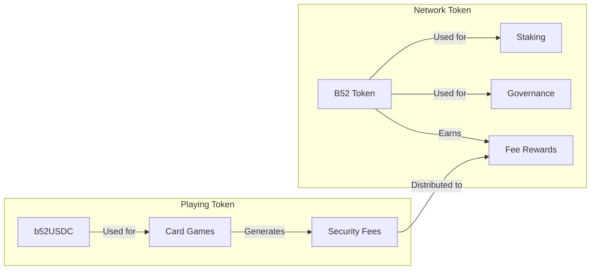

| Token | Purpose | Supply |
|-------|---------|--------|
| **B52** | Staking, Governance, Network Security | 52,000,000 (fixed) |
| **b52USDC** | Playing chips, bridged from Base Chain | Variable (1:1 with USDC) |

---

## Network Fee Flow

### The Cost of Decentralized Security

Every transaction on the network - game settlements, pot distributions, transfers - is secured by validators who stake B52 tokens. The protocol charges a small **security fee** proportional to the value being secured. This fee pays for decentralized, trustless security and is distributed to those who secure the network.

**The principle is simple:** Higher stakes = More value at risk = More security required = Higher fees earned by stakers.

This is how all proof-of-stake networks work - validators are economically incentivized to act honestly because they have skin in the game.

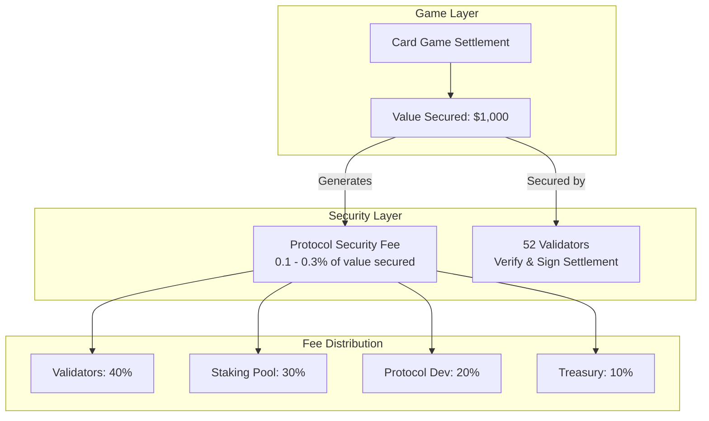

### Fee Distribution Breakdown

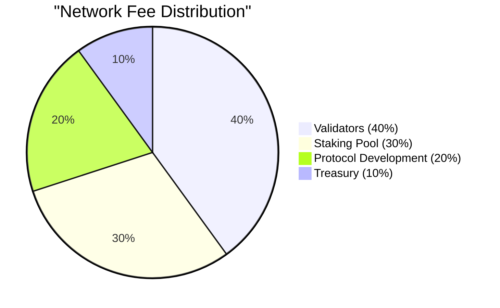

### Fee Distribution: Block52 vs THORChain

Block52's split is intentionally different from THORChain's because we have different needs.

| Recipient | Block52 | THORChain (Balanced) | Notes |
|-----------|---------|----------------------|-------|
| **Node Operators / Validators** | 40% | ~33% | Those running infrastructure |
| **Stakers / Delegators** | 30% | (included via bond providers) | Block52 separates this explicitly |
| **Liquidity Providers** | N/A | ~67% | THORChain needs LPs for swaps |
| **Protocol Development** | 20% | From Reserve | Block52 funds dev directly from fees |
| **Treasury / Reserve** | 10% | Separate emission | Emergency funds, grants |

### THORChain's Incentive Pendulum (Detailed)

THORChain uses a dynamic "Incentive Pendulum" that shifts rewards based on network needs:

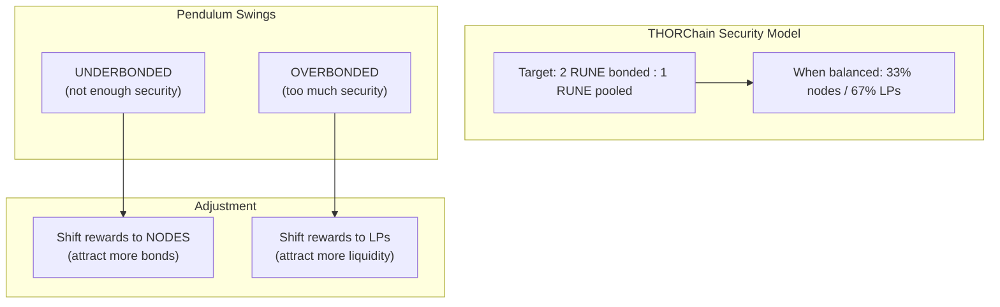

**How THORChain's split actually works:**

| Network State | Node Operators | Liquidity Providers | Why |
|---------------|----------------|---------------------|-----|
| **Balanced (2:1 ratio)** | ~33% | ~67% | Default equilibrium |
| **Underbonded** | Higher % | Lower % | Need more security |
| **Overbonded** | Lower % | Higher % | Need more liquidity |
| **Q4 2024 actual** | ~25% | ~75% | Network was overbonded |

**Why THORChain gives 67% to LPs:**
- THORChain is a **DEX** - it facilitates cross-chain swaps
- No liquidity pools = no swaps possible = network is useless
- LPs take significant risk (impermanent loss, smart contract risk)
- THORChain MUST incentivize liquidity or the protocol fails

### Why Block52 is Different

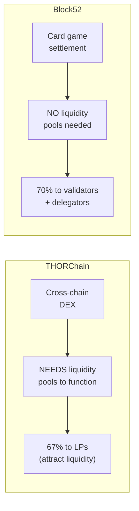

| | THORChain | Block52 |
|---|---|---|
| **What it does** | Cross-chain swaps | Poker game settlements |
| **Needs LP pools?** | Yes - swaps require liquidity | No - games don't need LP pools |
| **Main bottleneck** | Liquidity depth | Validator security |
| **Biggest risk** | Impermanent loss for LPs | Slashing for validators |
| **Primary incentive** | Attract liquidity providers | Attract validators & stakers |
| **Dev funding** | From treasury/reserve | Direct 20% from fees |

**The key insight:** THORChain gives 67% to LPs because they're the bottleneck. We give 70% combined to validators (40%) and delegators (30%) because **security is our bottleneck** - games need to be provably fair and settlements need to be trusted.

### Block52's Incentive Pendulum (Proposed)

Like THORChain, Block52 could use a dynamic pendulum - but balancing different things:

| | THORChain Balances | Block52 Could Balance |
|---|---|---|
| **Side A** | Node Operators (security) | Validators + Relay Nodes (infrastructure/decentralization) |
| **Side B** | Liquidity Providers (liquidity) | Delegators/Stakers (economic security) |
| **Goal** | 2:1 bond-to-pool ratio | Healthy infrastructure AND strong economic security |

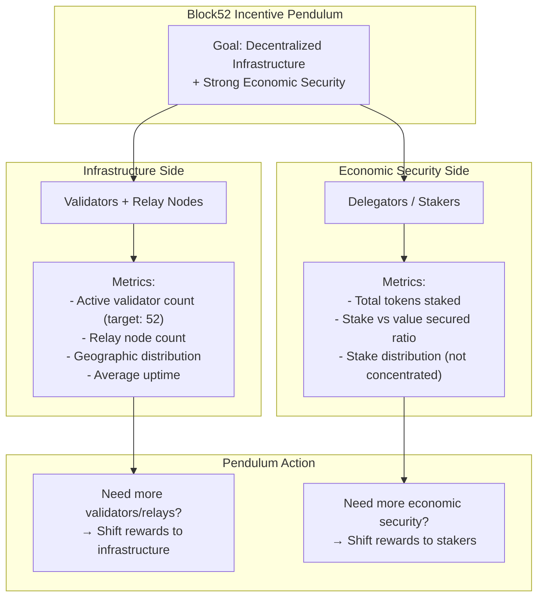

### How Block52's Pendulum Could Work

**Current baseline:** 40% validators / 30% delegators

**Dynamic adjustment based on network health:**

| Network State | Validator % | Delegator % | Why |
|---------------|-------------|-------------|-----|
| **Balanced** | 40% | 30% | Default equilibrium |
| **Need more validators** (< 52 active) | 50% | 20% | Attract infrastructure operators |
| **Need more relay nodes** | 45% | 25% | Incentivize relay participation |
| **Need more stake** (low security ratio) | 30% | 40% | Attract more token stakers |
| **Concentrated stake** (top 3 hold >50%) | 35% | 35% | Encourage distribution |

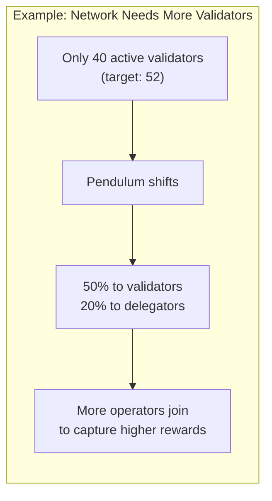

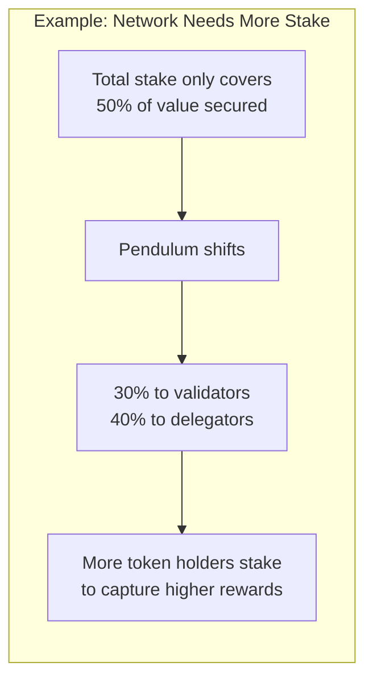

### Why Relay Nodes Matter for Decentralization

Relay nodes don't participate in consensus, but they:
- Propagate transactions faster (lower latency for players)
- Distribute game state globally
- Reduce load on validators
- Add geographic redundancy
- Make the network harder to DDoS

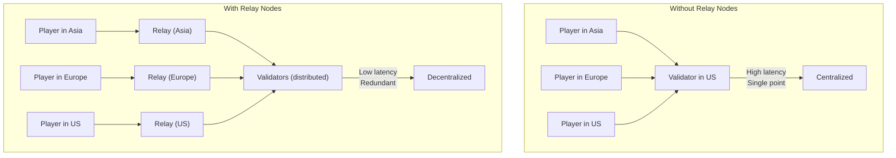

### Implementation Options

| Option | Description | Complexity |
|--------|-------------|------------|
| **Static (Current)** | Fixed 40/30/20/10 split | Simple |
| **Governance-Adjusted** | Community votes to change ratios periodically | Medium |
| **Automatic Pendulum** | Smart contract adjusts based on metrics | Complex |
| **Hybrid** | Automatic within bounds, governance for major changes | Medium-High |

> **Note:** These percentages are configurable via governance. The pendulum mechanism is proposed for discussion - we could start with static and add dynamic adjustment later.

### Value Proposition for Investors

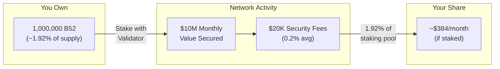

### Why This Model Works

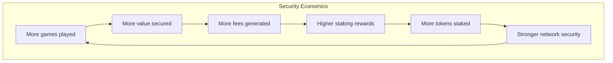

---

## Staking & Delegation

### What is Delegation?

**Delegation** lets you earn staking rewards without running a validator node yourself.

| | **Run a Validator** | **Delegate to a Validator** |
|---|---|---|
| **Requirement** | 100,000+ B52 + server + technical skills | Just 1,000+ B52 |
| **Effort** | Run node software 24/7, maintain uptime | Pick a validator, click "delegate" |
| **Your tokens** | Locked in your own validator | Still yours, bonded to their validator |
| **Rewards** | Full rewards + block production | Your share minus validator commission (5-10%) |
| **Risk** | Slashed if you misbehave | Slashed if your validator misbehaves |

> **Key point**: Your tokens never leave your control. Delegation just bonds them to a validator's stake, increasing their voting power and your reward share.

### How Staking Works

Anyone can stake B52 tokens with any validator to earn a share of network fees. You don't need to run infrastructure - just delegate to a validator you trust.

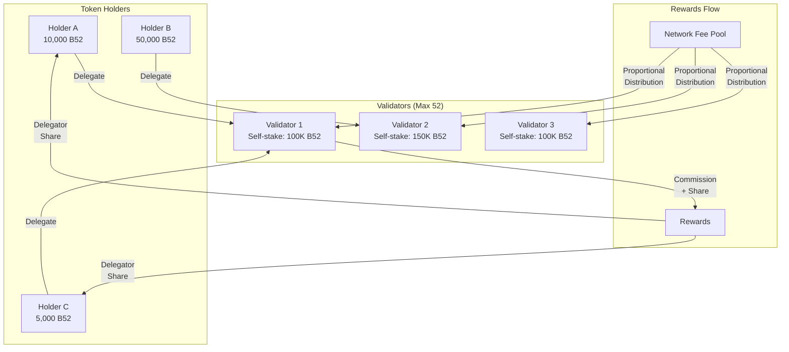

### Staking Tiers

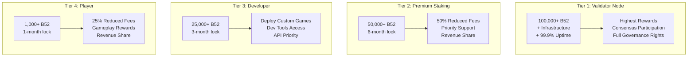

### Delegation Flow

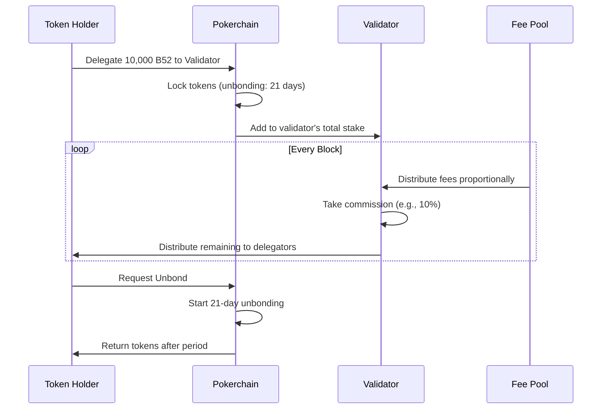

---

## Ethereum Bridge

### USDC Deposit Flow (Base Chain to Pokerchain)

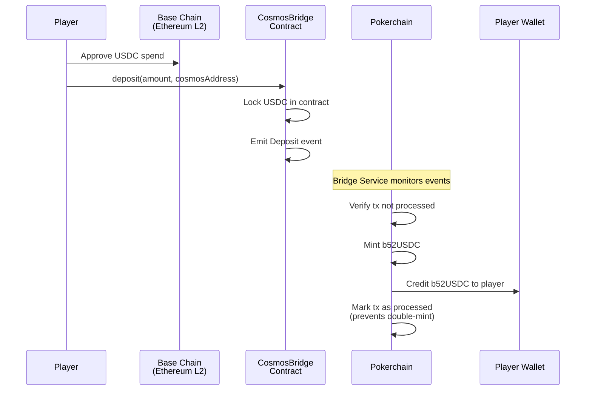

### USDC Withdrawal Flow (Pokerchain to Base Chain)

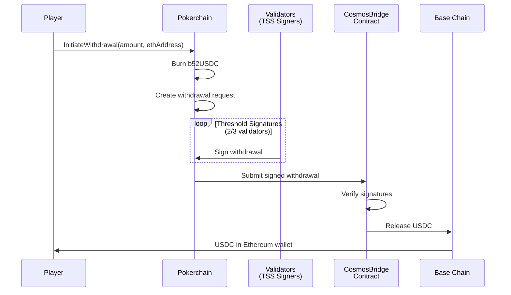

### Bridge Architecture

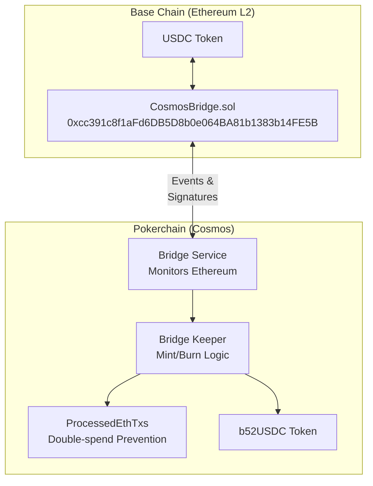

---

## Slashing Penalties

Based on THORChain's proven slashing model, validators face penalties for misbehavior to ensure network security.

### Slashing Conditions

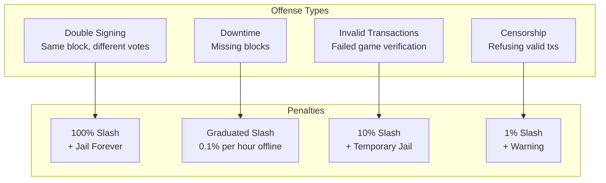

### Slashing Flow (THORChain Model)

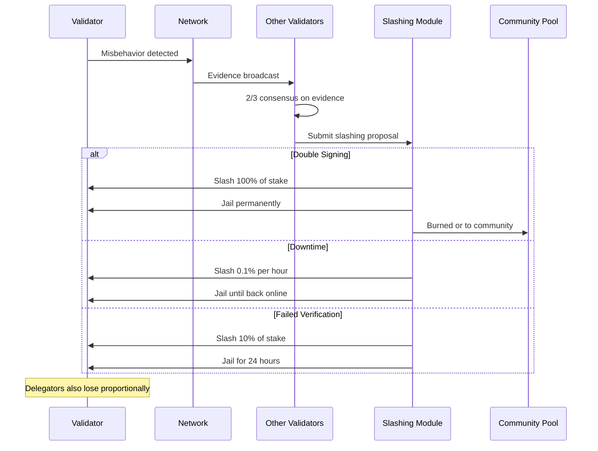

### Slashing Impact on Delegators

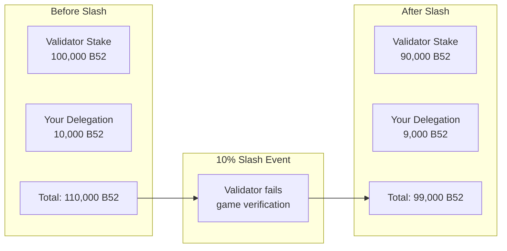

> **Warning**: When you delegate, you share in both rewards AND slashing risks. Choose validators carefully based on their track record.

---

## Governance

### Voting Rights: Holding vs Staking

```mermaid
flowchart TB
    subgraph "Option A: Holding-Based Voting"
        HoldA["Hold 10,000 B52"]
        VoteA["10,000 Votes"]
        ProA["Pro: Simple<br/>Con: No skin in game"]
    end

    subgraph "Option B: Staking-Based Voting (Recommended)"
        StakeB["Stake 10,000 B52"]
        VoteB["10,000 Votes"]
        ProB["Pro: Aligned incentives<br/>Con: Excludes liquid holders"]
    end

    subgraph "Option C: Hybrid"
        HoldC["Hold: 1x weight"]
        StakeC["Stake: 2x weight"]
        VoteC["Stakers have more say"]
        ProC["Pro: Rewards commitment<br/>Con: More complex"]
    end

    HoldA --> VoteA --> ProA
    StakeB --> VoteB --> ProB
    HoldC --> StakeC --> VoteC --> ProC
```

### Governance Flow

```mermaid
sequenceDiagram
    participant Proposer as Proposer<br/>(1000+ B52 staked)
    participant Chain as Pokerchain
    participant Voters as All Stakers
    participant Exec as Execution

    Proposer->>Chain: Submit Proposal<br/>+ Deposit (refundable)
    Chain->>Chain: 7-day Voting Period

    loop Voting Period
        Voters->>Chain: Vote (Yes/No/Abstain/Veto)
    end

    alt Quorum Met + Majority Yes
        Chain->>Exec: Execute Proposal
        Chain->>Proposer: Return Deposit
    else No Quorum or Majority No
        Chain->>Chain: Proposal Rejected
        Chain->>Proposer: Return Deposit
    else >33% Veto
        Chain->>Chain: Proposal Vetoed
        Chain->>Chain: Burn Deposit
    end
```

### What Can Be Governed?

```mermaid
mindmap
  root((Governance))
    Protocol Parameters
      Network fee percentage
      Slashing amounts
      Unbonding period
      Validator cap (52)
    Upgrades
      Protocol upgrades
      Bridge updates
      New game types
    Treasury
      Development funding
      Grants program
      Marketing spend
    Emergency
      Pause bridge
      Slash malicious validator
      Parameter hotfix
```

---

## Future Mechanisms

### Planned Token Utilities

```mermaid
flowchart TB
    subgraph "Current (Live)"
        C1[Validator Staking]
        C2[Delegation]
        C3[Network Fee Share]
    end

    subgraph "Phase 2 (Planned)"
        P1[Governance Voting]
        P2[Fee Discounts for Stakers]
        P3[Developer Staking Tier]
    end

    subgraph "Phase 3 (Future)"
        F1[Liquidity Mining]
        F2[Game Creator Rewards]
        F3[Insurance Pool]
        F4[Cross-chain Staking]
    end

    subgraph "Research (Placeholder)"
        R1[veB52 Model<br/>Vote-escrowed tokens]
        R2[NFT Integration<br/>Poker achievements]
        R3[Buyback & Burn<br/>From treasury]
        R4[Referral Rewards<br/>Paid in B52]
    end

    C1 --> P1
    C2 --> P2
    C3 --> P3
    P1 --> F1
    P2 --> F2
    P3 --> F3
    F1 --> R1
    F2 --> R2
    F3 --> R3
    F4 --> R4
```

### Potential: Vote-Escrowed B52 (veB52)

> **Placeholder for Discussion**

```mermaid
flowchart LR
    subgraph "Lock B52"
        Lock["Lock 10,000 B52<br/>for 1-4 years"]
    end

    subgraph "Receive veB52"
        ve1["1 year lock = 2,500 veB52"]
        ve2["2 year lock = 5,000 veB52"]
        ve4["4 year lock = 10,000 veB52"]
    end

    subgraph "Benefits"
        B1["Boosted staking rewards"]
        B2["Higher governance weight"]
        B3["Protocol fee share"]
    end

    Lock --> ve1 & ve2 & ve4
    ve1 & ve2 & ve4 --> B1 & B2 & B3
```

### Potential: Insurance Pool

> **Placeholder for Discussion**

```mermaid
flowchart TB
    subgraph "Funding"
        TreasuryFund["10% of Treasury"]
        SlashFund["Slashed tokens"]
    end

    subgraph "Insurance Pool"
        Pool["Insurance Reserve"]
    end

    subgraph "Claims"
        Bridge["Bridge Exploit"]
        Validator["Validator Failure"]
        Bug["Smart Contract Bug"]
    end

    TreasuryFund --> Pool
    SlashFund --> Pool
    Pool --> |"Governed<br/>Claims Process"| Bridge & Validator & Bug
```

---

## Summary: Why Hold B52?

```mermaid
flowchart TB
    subgraph "Value Drivers"
        V1["Fixed Supply<br/>52M tokens forever"]
        V2["Network Fees<br/>% of value secured"]
        V3["Validator Security<br/>Staked tokens secure network"]
        V4["Governance<br/>Control protocol future"]
    end

    subgraph "How to Earn"
        E1["Stake with Validator<br/>Easiest: just delegate"]
        E2["Run Validator<br/>100K+ B52 + infrastructure"]
        E3["Provide Liquidity<br/>Future DEX pools"]
    end

    subgraph "Token Flows"
        In["IN: Buy on exchange"]
        Out["OUT: Sell on exchange"]
        Lock["LOCKED: Staked/Delegated"]
        Burn["BURNED: Slashing penalties"]
    end

    V1 & V2 & V3 & V4 --> E1 & E2 & E3
    E1 & E2 & E3 --> Lock
    In --> Lock
    Lock --> Out
    Lock --> Burn
```

---

## Concrete Example: $10 Pot Scenario

### Who Gets What?

Let's trace exactly where the money goes when a $10 pot is won on the network.

```mermaid
flowchart TB
    subgraph "The Hand"
        Pot["Pot Won: $10.00"]
    end

    subgraph "Security Fee Collection"
        Fee["Security Fee: 0.2%<br/>= $0.02"]
        Winner["Winner Receives<br/>$9.98"]
    end

    subgraph "Fee Distribution (The $0.02)"
        Vals["All Validators: 40%<br/>= $0.008"]
        Stakers["All Delegators: 30%<br/>= $0.006"]
        Dev["Protocol Dev: 20%<br/>= $0.004"]
        Treasury["Treasury: 10%<br/>= $0.002"]
    end

    Pot --> Fee
    Pot --> Winner
    Fee --> Vals
    Fee --> Stakers
    Fee --> Dev
    Fee --> Treasury
```

### Validator vs Delegator Earnings

**Scenario:** Network processes $1,000,000 in pots per month

| | Calculation | Amount |
|---|---|---|
| **Total Pots** | - | $1,000,000 |
| **Security Fees (0.2%)** | $1M × 0.2% | $2,000 |
| **To Validators (40%)** | $2,000 × 40% | $800 |
| **To Delegators (30%)** | $2,000 × 30% | $600 |

#### If You Run a Validator

```mermaid
flowchart LR
    subgraph "Your Validator"
        Bond["Your Bond: 100,000 B52"]
        Share["Your Share: 1/52 validators"]
    end

    subgraph "Monthly Earnings"
        ValShare["Validator Pool: $800"]
        YourVal["Your Share: $15.38<br/>($800 ÷ 52)"]
        Commission["+ Commission from<br/>your delegators"]
    end

    Bond --> Share --> ValShare --> YourVal
```

**Validator earnings:** ~$15.38/month from $1M volume (before delegator commissions)

#### If You Delegate

```mermaid
flowchart LR
    subgraph "Your Delegation"
        Del["Delegate: 10,000 B52"]
        ToVal["To Validator X"]
    end

    subgraph "Validator X Total Stake"
        ValBond["Validator Bond: 100,000 B52"]
        AllDel["All Delegations: 400,000 B52"]
        Total["Total Stake: 500,000 B52"]
    end

    subgraph "Your Monthly Earnings"
        Pool["Delegator Pool: $600"]
        ValXShare["Validator X Share<br/>(proportional to total stake)"]
        YourShare["Your 2% of Val X<br/>= ~$0.23/month"]
        MinusComm["Minus 10% commission<br/>= ~$0.21/month"]
    end

    Del --> ToVal --> Total
    Pool --> ValXShare --> YourShare --> MinusComm
```

**Delegator earnings:** Smaller per token, but no infrastructure costs.

### Earnings Scale With Volume

| Monthly Network Volume | Security Fees | Validators Share | Delegator Pool |
|------------------------|---------------|------------------|----------------|
| $1M | $2,000 | $800 | $600 |
| $10M | $20,000 | $8,000 | $6,000 |
| $100M | $200,000 | $80,000 | $60,000 |
| $1B | $2,000,000 | $800,000 | $600,000 |

---

## Validator Requirements

### What Does It Take to Run a Validator?

```mermaid
flowchart TB
    subgraph "Token Requirements"
        MinBond["Minimum Bond: 100,000 B52"]
        Competitive["Competitive: Higher bond = more rewards"]
    end

    subgraph "Technical Requirements"
        Server["Dedicated Server<br/>8+ CPU, 32GB RAM, 1TB SSD"]
        Uptime["99.9% Uptime<br/>24/7/365"]
        Chains["Run Full Nodes<br/>Cosmos + Bridge Monitoring"]
        Security["Security Hardening<br/>Firewall, SSH keys, monitoring"]
    end

    subgraph "Skills Required"
        Linux["Linux Administration"]
        Cloud["Cloud Infrastructure<br/>(AWS, GCP, bare metal)"]
        Monitoring["Monitoring & Alerting"]
        OnCall["On-call Availability"]
    end

    MinBond --> Server
    Server --> Uptime --> Chains --> Security
    Linux --> Cloud --> Monitoring --> OnCall
```

### Validator Economics

| Cost/Benefit | Amount | Notes |
|--------------|--------|-------|
| **Minimum Bond** | 100,000 B52 | Locked while validating |
| **Server Costs** | ~$200-500/month | Cloud or dedicated |
| **Rewards** | Variable | Based on network volume |
| **Delegator Commission** | 5-20% | You set this rate |
| **Slashing Risk** | Up to 100% | For misbehavior |

---

## THORChain Comparison

Block52's security model is inspired by [THORChain](https://thorchain.org), a proven decentralized cross-chain protocol. Here's how we compare:

### Side-by-Side Comparison

| Mechanism | THORChain | Block52 | Notes |
|-----------|-----------|---------|-------|
| **Purpose** | Cross-chain swaps | Decentralized card games | Different use case, similar security needs |
| **Native Token** | RUNE | B52 | Fixed supply |
| **Total Supply** | ~500M RUNE | 52M B52 | B52 is scarcer |
| **Max Validators** | ~100 active | 52 | Block52: 52 cards theme |
| **Min Validator Bond** | 300,000 RUNE | 100,000 B52 | Similar barrier to entry |
| **Bond Providers** | Up to 10 per node | Unlimited delegators | Block52 more accessible |
| **Economic Security** | Bond > 2x assets secured | Bond > assets secured | Similar principle |
| **Slashing (Theft)** | 1.5x stolen amount | 100% of bond | Both severe |
| **Slashing (Downtime)** | Slash points (lose rewards) | 0.1%/hour of bond | Both penalize downtime |
| **Slashing (Double Sign)** | Severe bond slash | 100% of bond | Both prevent attacks |
| **Reward Split** | ~33% nodes / ~67% LPs (dynamic) | 40% validators / 30% stakers (static) | THORChain needs LPs; Block52 needs security |
| **Churning** | Every ~2.5 days | TBD | Rotates validators |
| **Unbonding Period** | Immediate (with churn) | 21 days | Standard Cosmos |

### What We Adopted from THORChain

```mermaid
flowchart TB
    subgraph "THORChain Proven Patterns"
        T1["Economic Security<br/>Bond > Value Secured"]
        T2["Slashing for Misbehavior<br/>Skin in the game"]
        T3["Bond Providers<br/>Delegation model"]
        T4["Validator Rotation<br/>Prevent centralization"]
        T5["Transparent Rewards<br/>On-chain distribution"]
    end

    subgraph "Block52 Adaptations"
        B1["Validators secure<br/>game settlements"]
        B2["Slash for failed<br/>game verification"]
        B3["Open delegation<br/>Anyone can stake"]
        B4["52 validator cap<br/>Thematic + decentralized"]
        B5["Fee from value<br/>secured in games"]
    end

    T1 --> B1
    T2 --> B2
    T3 --> B3
    T4 --> B4
    T5 --> B5
```

### Why This Model Works for Poker

| THORChain Secures | Block52 Secures |
|-------------------|-----------------|
| Cross-chain swaps worth $Ms | Poker pots worth $1000s |
| Assets in liquidity pools | Chips in active games |
| Bridge transactions | Deposit/withdrawal bridges |

**Same principle:** Validators must have more at stake than they could steal, making honesty more profitable than cheating.

```mermaid
flowchart LR
    subgraph "Economic Security"
        Stake["Validator Stakes<br/>100,000 B52"]
        Secures["Secures Games<br/>Worth < 100K B52"]
        Profit["Honest: Earn Rewards"]
        Cheat["Cheat: Lose Everything"]
    end

    Stake --> Secures
    Secures --> Profit
    Secures --> Cheat
    Profit --> |"Rational Choice"| Stake
    Cheat --> |"Irrational"| Stake
```

### THORChain Slashing Model (What We Follow)

Based on [THORChain's security model](https://docs.thorchain.org/how-it-works/security):

| Offense | THORChain Penalty | Block52 Penalty |
|---------|-------------------|-----------------|
| **Unauthorized Transaction** | 1.5x value slashed from bond | 100% bond slash |
| **Double Signing** | Severe slash + jail | 100% bond slash + permanent jail |
| **Downtime** | Slash points (lose rewards) | 0.1% bond per hour offline |
| **Failed Observation** | Slash points | 10% bond slash |
| **Lowest Performance** | Churned out at rotation | Churned out at rotation |

> **Key insight from THORChain:** Loss of principal (bond) is the primary driver of economic security. Validators must have more to lose than they could gain from cheating.

---

## Quick Reference

| Metric | Value |
|--------|-------|
| Total Supply | 52,000,000 B52 |
| Max Validators | 52 |
| Min Validator Stake | 100,000 B52 |
| Min Delegation | 1,000 B52 |
| Unbonding Period | 21 days |
| Security Fee | 0.1-0.3% of value secured |
| Double-sign Slash | 100% |
| Downtime Slash | 0.1%/hour |

---

## FAQ: Validators & Network

### Q: If 100,000 B52 is the minimum, what if more than 52 people want to run a validator?

**Only the top 52 by total stake are "active" validators.** The rest become standby validators.

```mermaid
flowchart TB
    subgraph "All Validators"
        V1["Validator A: 500K B52 total"]
        V2["Validator B: 400K B52 total"]
        V3["..."]
        V52["Validator #52: 150K B52 total"]
        V53["Validator #53: 140K B52 total"]
        V54["Validator #54: 120K B52 total"]
    end

    subgraph "Active Set (Top 52)"
        Active["Earn rewards<br/>Participate in consensus<br/>Secure games"]
    end

    subgraph "Standby Set (The Rest)"
        Standby["No rewards<br/>Ready to join<br/>Waiting for spot"]
    end

    V1 & V2 & V3 & V52 --> Active
    V53 & V54 --> Standby
```

**How it works:**

| | Active Validators (Top 52) | Standby Validators |
|---|---|---|
| **Earns rewards** | Yes | No |
| **Participates in consensus** | Yes | No |
| **Can be delegated to** | Yes | Yes |
| **Minimum stake** | 100,000 B52 | 100,000 B52 |
| **What matters** | Total stake (bond + delegations) | Total stake |

### Q: How does a standby validator become active?

**By getting more total stake than the lowest active validator.**

```mermaid
sequenceDiagram
    participant Standby as Standby Validator<br/>(#53, 140K B52)
    participant Active52 as Active Validator<br/>(#52, 150K B52)
    participant Network as Network

    Note over Standby: Attracts 20K B52 in delegations
    Standby->>Network: Now has 160K B52 total

    Note over Network: At next epoch/churn...
    Network->>Standby: You're now #52 (Active)
    Network->>Active52: You're now #53 (Standby)

    Note over Active52: Stops earning rewards
    Note over Standby: Starts earning rewards
```

**Ways to move up:**
1. Increase your own bond
2. Attract more delegators (good performance, low commission, reputation)
3. Wait for an active validator to get slashed or leave

### Q: Do validators rotate like THORChain's churning?

**Yes, we can implement rotation (churning) for extra security.**

THORChain churns every ~2.5 days, rotating out:
- Lowest bond validator
- Worst performing validator
- Oldest validator (longest time active)

```mermaid
flowchart TB
    subgraph "Churn Event (e.g., every 7 days)"
        Check["Check all 52 active validators"]
        Lowest["Lowest stake?"]
        Worst["Worst performance?"]
        Oldest["Longest active?"]
    end

    subgraph "Rotation"
        Out["These 3 rotate OUT<br/>(become standby)"]
        In["Top 3 standby<br/>rotate IN"]
    end

    Check --> Lowest & Worst & Oldest
    Lowest & Worst & Oldest --> Out
    Out --> In
```

**Why rotation helps:**
- Prevents validators from getting "too comfortable"
- Gives standby validators a fair chance
- Keeps validators competitive on performance
- Distributes rewards more fairly over time

> **Note:** Churning frequency is configurable via governance. Could be weekly, bi-weekly, etc.

### Q: What's the difference between a validator and a relay node?

| | Validator (Active) | Validator (Standby) | Relay Node |
|---|---|---|---|
| **Purpose** | Secure network, sign blocks | Wait to become active | Propagate data, not consensus |
| **Earns rewards** | Yes | No | No (or minimal) |
| **Needs 100K B52** | Yes | Yes | No |
| **Participates in consensus** | Yes | No | No |
| **Can be slashed** | Yes | No (not active) | No |

**Relay nodes** (if we implement them) would be lightweight nodes that help propagate transactions and game state but don't participate in consensus. They could be run by anyone without staking.

### Q: I have 100K B52 but I'm standby (#53). Do I still earn validator rewards?

**No.** The 40% validator rewards ONLY go to the 52 active validators who are actually doing the work.

```mermaid
flowchart TB
    subgraph "Fee Pool: $1,000"
        Fees["Network Fees Collected"]
    end

    subgraph "40% Validator Pool = $400"
        V1["Active #1: Gets share"]
        V2["Active #2: Gets share"]
        V52["Active #52: Gets share"]
        V53["Standby #53: Gets $0"]
        V54["Standby #54: Gets $0"]
    end

    subgraph "30% Delegator Pool = $300"
        D1["Anyone who delegates<br/>(including standby validators!)"]
    end

    Fees --> |"40%"| V1 & V2 & V52
    Fees --> |"30%"| D1
    V53 -.-> |"$0"| Fees
    V54 -.-> |"$0"| Fees
```

**Why?** Because standby validators aren't actually:
- Signing blocks
- Verifying game settlements
- Running infrastructure 24/7
- Taking on slashing risk

They're just *waiting* with tokens ready.

### Q: That seems unfair. I have 100K B52 bonded but earn nothing as standby?

**You have options:**

| Option | What You Do | What You Earn |
|--------|-------------|---------------|
| **Wait as standby** | Keep node ready, hope to enter top 52 | Nothing (until active) |
| **Delegate your bond** | Delegate your 100K to an active validator | Share of 30% delegator pool |
| **Both** | Run standby node + delegate extra tokens | Delegator rewards now, validator rewards when active |

**Best strategy if you're standby:**

```mermaid
flowchart LR
    subgraph "Your 150K B52"
        Bond["100K: Bonded to your standby node"]
        Extra["50K: Delegate to Active Validator"]
    end

    subgraph "Your Earnings"
        Now["NOW: Earn from 50K delegation"]
        Later["LATER: When you're active,<br/>earn validator rewards too"]
    end

    Bond --> Later
    Extra --> Now
```

You can delegate your *extra* tokens (above 100K minimum) to an active validator and earn from the delegator pool while waiting.

### Q: So what's the actual split? Let me make sure I understand.

**Here's exactly who gets what:**

| Pool | % | Who Gets It | Requirement |
|------|---|-------------|-------------|
| **Validators** | 40% | Only the 52 active validators | Must be top 52 by stake + running node |
| **Delegators** | 30% | Anyone who delegates (to any active validator) | Just delegate tokens |
| **Development** | 20% | Protocol development fund | N/A |
| **Treasury** | 10% | Reserve fund | N/A |

**Key insight:**
- **Validators (40%)** = Payment for *doing the work* (infrastructure, signing, risk)
- **Delegators (30%)** = Payment for *providing stake* (economic security)

If you're standby, you're not doing validator work, so you don't get validator pay. But you CAN provide stake by delegating, and earn from that.

### Q: So validators are competing for the top 52 spots?

**Yes, exactly.** This competition is healthy for the network:

```mermaid
flowchart LR
    subgraph "Competition Drives"
        C1["Better uptime<br/>(avoid slashing)"]
        C2["Lower commission<br/>(attract delegators)"]
        C3["Better hardware<br/>(faster, reliable)"]
        C4["Community presence<br/>(build trust)"]
    end

    subgraph "Results In"
        R1["More secure network"]
        R2["Better service"]
        R3["Fair rewards"]
    end

    C1 & C2 & C3 & C4 --> R1 & R2 & R3
```

**As a delegator, this benefits you** - validators compete for your delegation by offering better service and lower commissions.

---

## FAQ: Staking & Delegation Risks

### Q: If I delegate, do I have to trust the validator?

**Yes, partially.** When you delegate, you're trusting that the validator will:
- Keep their node online (99.9% uptime)
- Not double-sign blocks
- Not attempt to steal funds
- Properly verify game settlements

You're NOT trusting them with custody - your tokens remain yours. But you ARE sharing in their risk.

### Q: If my validator gets slashed, do I lose tokens too?

**Yes.** This is how ALL proof-of-stake networks work, including [THORChain](https://docs.thorchain.org/thornodes/overview/risks-costs-and-rewards) and Cosmos.

```mermaid
flowchart TB
    subgraph "Validator Misbehaves"
        Val["Validator X<br/>Double-signs a block"]
        Slash["Network slashes 5%<br/>of total stake"]
    end

    subgraph "Who Loses What"
        ValBond["Validator's 100K B52<br/>Loses 5K B52"]
        Del1["Delegator A's 50K B52<br/>Loses 2.5K B52"]
        Del2["Delegator B's 10K B52<br/>Loses 500 B52"]
    end

    Val --> Slash
    Slash --> ValBond
    Slash --> Del1
    Slash --> Del2
```

**Everyone loses proportionally.** If 5% is slashed, you lose 5% of your delegation.

### Q: That seems unfair. Why should I be punished for their mistake?

**It's actually a security feature, not a bug.** Here's why:

| If delegators had NO risk | If delegators SHARE risk (current) |
|---------------------------|-----------------------------------|
| Delegate to anyone, who cares | Research validators carefully |
| Ignore validator performance | Monitor your validator |
| No incentive to redelegate | Redelegate if problems appear |
| Bad validators get same delegations | Bad validators lose delegations |
| Network security weakens | Network security strengthens |

**The shared risk makes YOU part of the security system.** You're incentivized to:
1. Choose reputable validators with good track records
2. Diversify across multiple validators
3. Monitor validator performance
4. Redelegate away from problematic validators

### Q: How does THORChain handle this?

**Exactly the same way.** From [THORChain's docs](https://docs.thorchain.org/thornodes/pooled-thornodes):

> "Bond providers share in the slashing risk proportionally. If the node operator engages in malicious behavior, the bond—including contributions from all bond providers—gets slashed."

THORChain has two types of slashing:

| Type | Affects | Example |
|------|---------|---------|
| **Reward Slashing** | Only earned rewards | Missing observations, failed signatures |
| **Bond Slashing** | Your actual stake | Double-signing, theft attempts |

Block52 follows the same model.

### Q: How do I protect myself as a delegator?

```mermaid
flowchart TB
    subgraph "Before Delegating"
        R1["Research validator history"]
        R2["Check uptime record"]
        R3["Look at commission rate"]
        R4["Verify they're not over-concentrated"]
    end

    subgraph "After Delegating"
        M1["Monitor validator status"]
        M2["Watch for slashing events"]
        M3["Check community reputation"]
        M4["Be ready to redelegate"]
    end

    subgraph "Risk Mitigation"
        D1["Split across 2-3 validators"]
        D2["Don't chase lowest commission"]
        D3["Prefer established operators"]
    end

    R1 --> R2 --> R3 --> R4
    M1 --> M2 --> M3 --> M4
    D1 --> D2 --> D3
```

**Best practices:**
1. **Diversify** - Don't delegate everything to one validator
2. **Research** - Check validator's history, uptime, community reputation
3. **Don't chase lowest commission** - 5% commission with 100% uptime > 0% commission with 95% uptime
4. **Monitor** - Set up alerts or check periodically
5. **Redelegate quickly** - If you see problems, move your stake

### Q: What are the actual slashing scenarios?

| Scenario | Likelihood | Severity | Your Loss |
|----------|------------|----------|-----------|
| **Downtime (few hours)** | Common | Low | Small reward reduction |
| **Extended downtime** | Uncommon | Medium | 0.1%/hour of stake |
| **Failed game verification** | Rare | Medium | 10% of stake |
| **Double-signing** | Very rare | Severe | 100% of stake |
| **Theft attempt** | Extremely rare | Total | 100% of stake |

**Reality check:** Most slashing events are minor (downtime). Severe slashing (double-sign, theft) is extremely rare because:
- Validators have 100K+ B52 at stake
- They'd lose everything
- It's economically irrational

### Q: Can I undelegate if I see problems?

**Yes, but there's a 21-day unbonding period.** During this time:
- Your tokens are locked
- You don't earn rewards
- You're still exposed to slashing

This is why monitoring matters - you want to redelegate BEFORE problems occur.

```mermaid
sequenceDiagram
    participant You
    participant Chain
    participant NewVal as New Validator

    You->>Chain: Request Unbond
    Note over Chain: 21-day unbonding starts
    Note over You: Still at risk during this period!
    Chain->>You: Tokens returned after 21 days

    Note over You: OR use Redelegate (instant switch)

    You->>Chain: Redelegate to New Validator
    Chain->>NewVal: Stake moved instantly
    Note over You: No unbonding wait!
```

**Pro tip:** Use **redelegate** instead of unbond+delegate. It's instant and you keep earning rewards.

### Q: Why would anyone run a validator honestly?

**Because honesty pays more than cheating.**

```mermaid
flowchart LR
    subgraph "Honest Validator"
        H1["Stake 100K B52"]
        H2["Earn rewards forever"]
        H3["Build reputation"]
        H4["Attract more delegators"]
        H5["Earn more commission"]
    end

    subgraph "Cheating Validator"
        C1["Stake 100K B52"]
        C2["Try to steal"]
        C3["Get caught instantly"]
        C4["Lose 100% of stake"]
        C5["Banned from network"]
    end

    H1 --> H2 --> H3 --> H4 --> H5
    C1 --> C2 --> C3 --> C4 --> C5
```

**The math:**
- Honest validator with 100K B52 earning 10% APY = 10K B52/year, every year
- Cheating validator = lose 100K B52 instantly

Cheating is economically irrational.

---

## FAQ: Why More Stakers = More Security

### Q: Does having more people staking actually make the network more secure?

**Yes, absolutely.** This is the fundamental principle of proof-of-stake security.

```mermaid
flowchart TB
    subgraph "More Stakers = More Security"
        A["More people stake B52"]
        B["Total staked value increases"]
        C["Cost to attack network increases"]
        D["Attack becomes economically irrational"]
        E["Network is more secure"]
    end

    A --> B --> C --> D --> E
```

### Q: How exactly does staking provide security?

**Economic security = "skin in the game"**

To attack the network, you'd need to control enough stake to manipulate consensus. The more tokens staked by honest participants, the more expensive and difficult this becomes.

```mermaid
flowchart LR
    subgraph "Attack Cost Calculation"
        Total["Total Staked: 30M B52"]
        Need["Need 67% for attack: 20M B52"]
        Price["At $1 per B52: $20M attack cost"]
        Plus["+ You lose it all when caught"]
    end

    Total --> Need --> Price --> Plus
```

| Total Staked | Attack Cost (67% needed) | Practical? |
|--------------|--------------------------|------------|
| 5M B52 | ~$3.3M | Risky but possible |
| 15M B52 | ~$10M | Very expensive |
| 30M B52 | ~$20M | Economically irrational |
| 45M B52 | ~$30M | Virtually impossible |

### Q: Why does distribution of stake matter?

**Concentrated stake = centralization risk**

```mermaid
flowchart TB
    subgraph "Bad: Concentrated"
        C1["3 validators hold 60% of stake"]
        C2["They could collude"]
        C3["Single points of failure"]
        C4["Centralized in practice"]
    end

    subgraph "Good: Distributed"
        D1["Stake spread across 52 validators"]
        D2["No single validator > 5%"]
        D3["Collusion requires many parties"]
        D4["Truly decentralized"]
    end
```

**This is why the pendulum could shift rewards if stake becomes too concentrated** - to incentivize spreading tokens across more validators.

### Q: How do relay nodes add to security?

**Relay nodes provide infrastructure decentralization:**

| Security Aspect | Validators Only | Validators + Relay Nodes |
|-----------------|-----------------|--------------------------|
| **DDoS resistance** | Attack 52 targets | Attack 52 + hundreds of relays |
| **Geographic redundancy** | Limited locations | Global distribution |
| **Latency attacks** | Single path to validators | Multiple paths |
| **Censorship resistance** | 52 entry points | Many entry points |

```mermaid
flowchart TB
    subgraph "Attack Surface"
        V["52 Validators<br/>(must attack all)"]
        R["100+ Relay Nodes<br/>(redundant paths)"]
        Combined["Combined: Much harder to attack"]
    end

    V --> Combined
    R --> Combined
```

### Q: So both stakers AND infrastructure operators contribute to security?

**Yes, in different ways:**

| Contributor | What They Provide | How It Helps |
|-------------|-------------------|--------------|
| **Validators** | Infrastructure + Bond | Run the network, stake at risk |
| **Relay Nodes** | Infrastructure only | Distribute load, add redundancy |
| **Delegators** | Economic stake | Increase attack cost, align incentives |
| **Token holders** | Potential stake | Reserve pool for future security |

```mermaid
flowchart TB
    subgraph "Security Layers"
        L1["Layer 1: Validators<br/>(Consensus + Infrastructure)"]
        L2["Layer 2: Relay Nodes<br/>(Distribution + Redundancy)"]
        L3["Layer 3: Delegators<br/>(Economic Security)"]
        L4["Layer 4: Token Holders<br/>(Potential Security)"]
    end

    L1 --> L2 --> L3 --> L4
```

**This is why the pendulum matters** - if any layer is weak, rewards shift to strengthen it.

### Q: What's the ideal state for the network?

**Balanced infrastructure AND economic security:**

| Metric | Target | Why |
|--------|--------|-----|
| Active validators | 52 (full set) | Maximum decentralization of consensus |
| Relay nodes | 100+ globally | Geographic distribution, DDoS resistance |
| Total staked | >50% of supply (26M+ B52) | High attack cost |
| Stake concentration | No validator >5% | Prevent centralization |
| Stake vs value secured | Bond > games value | Economic security margin |

```mermaid
flowchart LR
    subgraph "Healthy Network"
        V["52 Active Validators ✓"]
        R["100+ Relay Nodes ✓"]
        S["30M+ B52 Staked ✓"]
        D["Well Distributed ✓"]
    end

    subgraph "Result"
        Secure["Extremely Secure"]
        Decentralized["Truly Decentralized"]
        Fast["Low Latency"]
    end

    V & R & S & D --> Secure & Decentralized & Fast
```

---

## Contracts & Addresses

| Component | Address | Network |
|-----------|---------|---------|
| CosmosBridge | `0xcc391c8f1aFd6DB5D8b0e064BA81b1383b14FE5B` | Base Chain |
| Pokerchain RPC | `https://node1.block52.xyz:26657` | Cosmos |
| Address Prefix | `b52` | Pokerchain |

---

*Document Version: Draft 1.0*
*Last Updated: December 2024*
*Status: For Team Review - Not Final*
