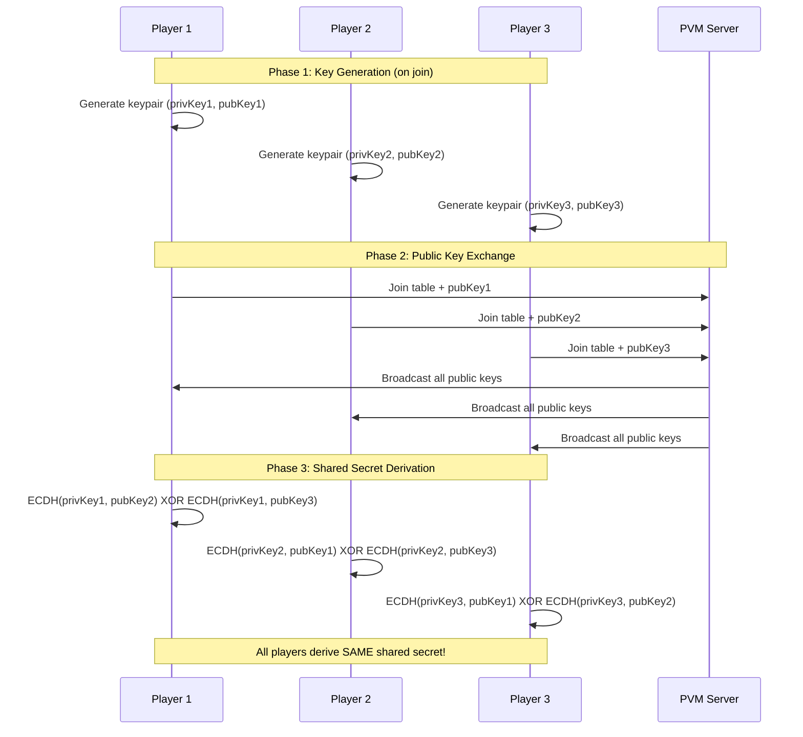
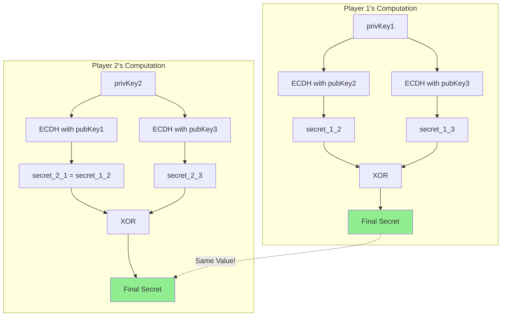
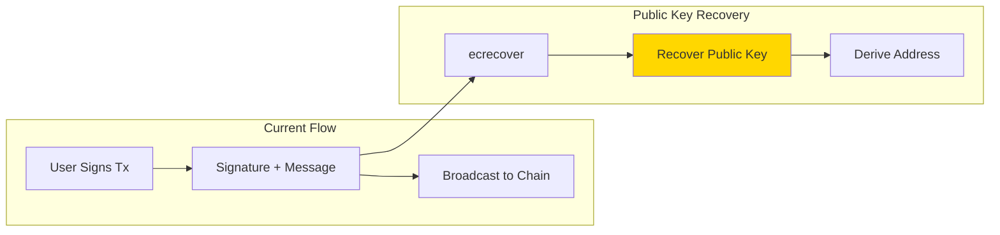
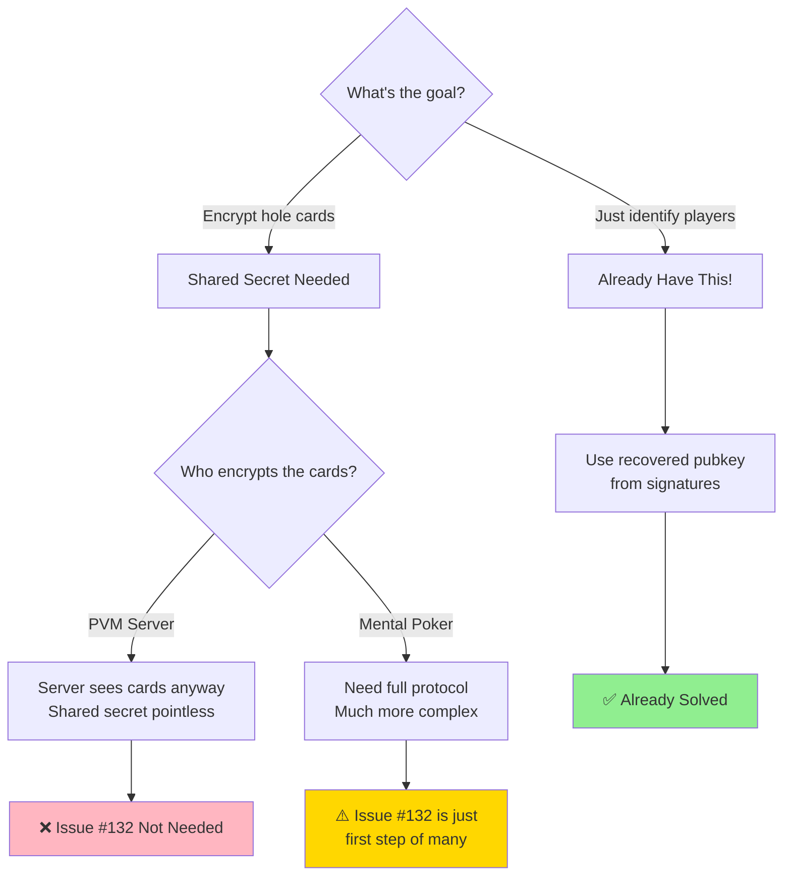

# Shared Secret Key Exchange Analysis

This document analyzes the ECDH shared secret mechanism in `scripts/shuffle-demo.py` and evaluates whether Issue #132 (passing public key on join) is necessary.

## Overview

The demo implements **Elliptic Curve Diffie-Hellman (ECDH)** key exchange to derive a shared secret between poker players. This shared secret could theoretically be used to encrypt hole cards.

## How ECDH Key Exchange Works



## The Math Behind It



## Code Breakdown

### 1. Key Generation (SECP256K1 - same curve as Bitcoin/Ethereum)

```python
def generate_keypair(self):
    private_key = ec.generate_private_key(ec.SECP256K1())
    public_key = private_key.public_key()
    return private_key, public_key
```

### 2. Shared Secret Derivation

```python
def derive_shared_secret(self, private_key, peer_public_key):
    # ECDH: shared_key = privKey * peerPubKey (elliptic curve multiplication)
    shared_key = private_key.exchange(ec.ECDH(), peer_public_key)

    # HKDF: Derive a uniform 32-byte key
    derived_key = HKDF(
        algorithm=hashes.SHA256(),
        length=32,
        info=b'poker_game_shared_secret'
    ).derive(shared_key)

    return derived_key
```

### 3. Combining Multiple Players' Secrets

```python
def compute_shared_secret(self, other_players_keys):
    final_secret = b'\x00' * 32

    for player_id, key_bytes in other_players_keys.items():
        if player_id != self.player_id:
            peer_public_key = deserialize(key_bytes)
            shared_secret = self.derive_shared_secret(self.private_key, peer_public_key)
            # XOR combine
            final_secret = bytes(a ^ b for a, b in zip(final_secret, shared_secret))

    return final_secret
```

---

## Critical Question: Do We Need Issue #132?

### Can We Get the Public Key from Signed Messages?

**YES!** Ethereum/Cosmos signatures are **recoverable**.



**We already do this!** In `query_game_state.go`:

```go
// We recover the public key from the signature to verify identity
recoveredPubKey, err := crypto.SigToPub(prefixedHash.Bytes(), signatureBytes)
```

### Where Public Keys Are Already Available

| Location | How We Get It |
|----------|---------------|
| Join Transaction | Recoverable from tx signature |
| WebSocket Auth | Recoverable from auth signature |
| Any Signed Action | Recoverable from action signature |

---

## My Assessment: Is Issue #132 Necessary?



## Recommendation

### Current Architecture (Trusted PVM Server)

The PVM server is a **trusted dealer** - it sees all cards. In this model:

- **Issue #132 is NOT necessary** - shared secrets don't help because the server already knows everything
- Public keys can be recovered from signatures when needed
- The demo is interesting but doesn't fit the architecture

### Future Architecture (Trustless Mental Poker)

If you want truly trustless poker where NO ONE sees the cards until revealed:

- Issue #132 would be just the **first of many steps**
- Would need full mental poker protocol (commutative encryption, ZK proofs)
- Much more complex than just sharing public keys

## Summary

| Question | Answer |
|----------|--------|
| Can we get pubkey from signature? | **Yes** - already do this |
| Does current architecture need shared secret? | **No** - PVM sees all cards anyway |
| Should we close Issue #132? | **Yes** - or re-scope for mental poker |
| Is the demo useful? | **Educational** - but not applicable to current design |

## If You Still Want Shared Secrets

If there's a specific use case (e.g., encrypted chat between players), you could:

1. **Option A**: Recover pubkey from first signed action (no code changes needed)
2. **Option B**: Add optional `publicKey` field to join message (Issue #132)
3. **Option C**: Full mental poker implementation (major undertaking)

---

*Generated for Issue #132 analysis*
